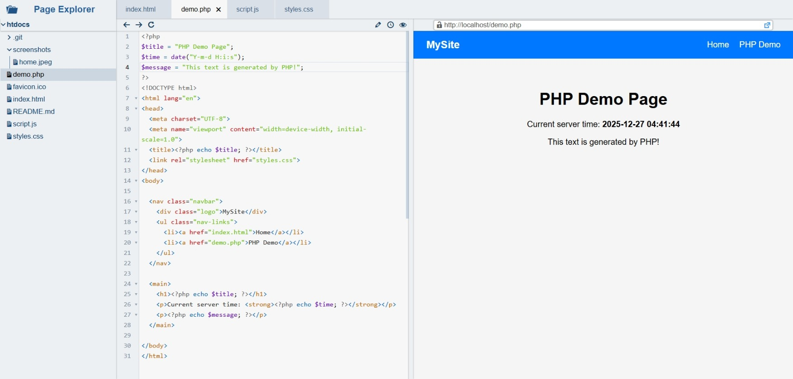
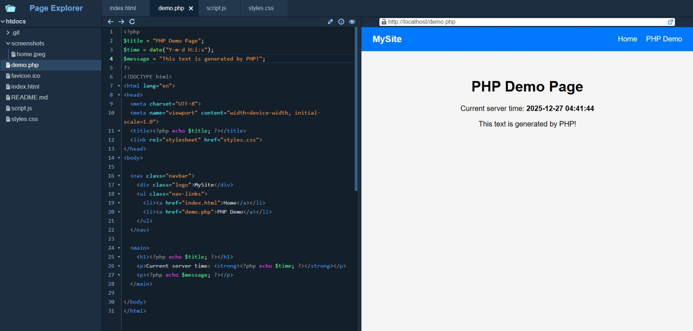

# qr-admin


A lightweight **Web-based Code Editor** built on **CodeMirror 5**, designed to run directly inside an Apache + PHP environment. The editor treats the web server's document root (e.g. `htdocs` on Windows or `html` on Linux) as the **workspace root**, providing a VS Code–like file explorer and in-browser editing experience.

**License:** [MIT](LICENSE)

**Try me here:** [https://qr.unaux.com/qr-admin/](https://qr.unaux.com/qr-admin/)

---

## 🖼️ Screenshots




---

## ✨ Features

- 📁 **File Explorer UI** (VS Code–like)
- ➕ Create new **files** and **folders**
- ✏️ Rename existing files and folders
- ⬆️ Upload local files to the server
- 🗜️ Compress files/folders into `.zip`
- 📦 Extract `.zip` files to their parent directory
- 👀 View text files in **CodeMirror 5**
- 💾 Edit and save text files directly in the browser
- 🌐 **Live Preview** of files via iframe
  - Supports HTML, CSS, JavaScript, and PHP
  - Files execute exactly as they would when accessed normally through Apache

---

## 🧱 Project Structure

```
qr-admin/
├── codemirror/       # CodeMirror 5 and related assets
├── css/
├── js/
├── api.php           # Backend API for filesystem operations
├── favicon.svg
└── index.html        # Main UI
```

> `qr-admin` itself is meant to be placed **directly under the web server's document root**.

---

## 🚀 Installation

### 1. Prerequisites

- Apache HTTP Server
- PHP (recommended PHP 7+)
- Web browser with JavaScript enabled

### 2. Setup

#### Windows (Apache + XAMPP/WAMP)

1. Copy the project folder into:
   ```
   C:/xampp/htdocs
   ```  
2. Start Apache
3. Open in browser:
   ```
   http://localhost/qr-admin/
   ```
#### Linux (Apache)

1. Copy the project folder into:
   ```
   /var/www/html
   ```
2. Ensure correct permissions:
   ```bash
   sudo chown -R www-data:www-data /var/www/html
   sudo chmod -R 755 /var/www/html
   ```
3. Open in browser:
   ```
   http://localhost/qr-admin/
   ```

---

## 🖥️ How It Works

- The **workspace root** is the web server's document root (`htdocs` / `html`)
- All files are already **servable by Apache**
- File operations are handled by `api.php`
- The editor loads and saves files using HTTP requests
- File previews are rendered using an **iframe**, pointing directly to the file URL

This design allows:
- Real PHP execution
- Accurate HTML/CSS/JS previews
- Zero build or bundling steps

---

## 🔐 Security Notes

This project is designed for **local development, internal tools, or trusted environments**.

⚠️ **Do not expose this application to the public internet without additional security hardening.**

The editor allows:
- Arbitrary file creation and modification
- ZIP extraction
- PHP execution via Apache

If publishing or deploying beyond localhost, you should:

- Protect access using Apache authentication or IP allowlists
- Add strict path validation and sandboxing in `api.php`
- Disable dangerous PHP functions (`exec`, `shell_exec`, etc.)
- Run under a restricted system user

---

## 🧩 Supported File Types

- Text-based files (editable):
  - `.html`, `.css`, `.js`, `.php`, `.json`, `.txt`, `.md`, etc.
- Binary files:
  - Upload / download supported
  - Not editable in CodeMirror

---

## 🛠️ Technologies Used

- **CodeMirror 5** – In-browser code editor
- **Vanilla JavaScript** – Frontend logic
- **PHP** – Filesystem API backend
- **Apache** – Static file serving & PHP execution

---

## 📌 Use Cases

- Local web development
- PHP/HTML/JS quick prototyping
- Lightweight alternative to desktop editors
- Embedded admin or developer tools

---

## 📝 Notes

- CodeMirror 5 is used intentionally for simplicity and stability
- No Node.js, build tools, or dependencies required
- Designed to be copied, deployed, and used immediately

---

Happy coding! 🚀
